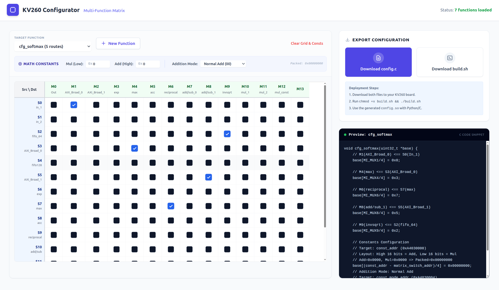

# ☑️This is the ToolChain for the configuration of the datastream


---

# 🔍How to Use it
```
cd ./dist
python -m http.server
xdg-open http://127.0.0.1:8000
```

---

You can use this toolchain to **configure the datastream** conveniently. You can check the box at the corresponding position to indicate that the output of the module **in that row is connected to the input of the module in that column**.

Then you can download the **C** code and the **build script** .

Run the build script to cross-compile the C code. Or just run:
```
aarch64-linux-gnu-gcc -o config.so -shared -fPIC config.c
```