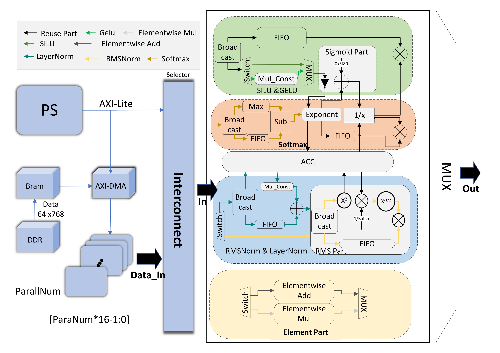

<div align="center">

# 🌊 River

### LLM Activation Function Accelerator on FPGA

**A reconfigurable dataflow architecture that unifies multiple activation functions into a single FPGA fabric with BF16 precision — featuring primitive-operator composition for custom pipeline design.**

[](./IEEE_FPT_Conference.pdf)
[]()
[]()
[]()
[](./LICENSE)

</div>

---

## 🏆 Awards

| Competition | Result |
|:---|:---|
| **IEEE FPT 2025 Design Competition** (FPGA Track) | 🥇 **First Prize** — the sole winner |
| **FPGA Innovation Competition** (National Finals) | 🥇 **National First Prize** |

> The **only** First Prize winner in the FPGA track of IEEE FPT 2025 Design Competition.

---

## 🔥 Highlights

- **30× faster** than Intel i7-12700H CPU, **6× faster** than NVIDIA RTX 3060 GPU
- **Reconfigurable dataflow** — compose custom operator pipelines via primitive operators, not limited to preset functions
- **7 built-in presets** (Softmax, SiLU, GELU, LayerNorm, RMSNorm, Add, Mul) with runtime switching — no bitstream regeneration needed
- **BF16 precision** with microsecond-level latency (2–7 μs)
- **Only 7.352 W** total power consumption on Xilinx KV260
- **Web-based visual configuration toolchain** — define dataflow topology via an interactive GUI

---

## 📊 Performance

### Latency & Accuracy (Input: 64×768, BF16, Parallelism = 32, Clock = 300 MHz)

| Function | L2 Relative Error | Latency |
|:---|:---|:---|
| Softmax | 3.36×10⁻³ | 5.78 μs |
| SiLU | 1.00×10⁻⁴ | 5.16 μs |
| GELU | 1.88×10⁻⁴ | 5.34 μs |
| RMSNorm | 3.11×10⁻³ | 6.58 μs |
| LayerNorm | 1.01×10⁻² | 7.40 μs |
| Element-wise Add | 0 | 2.02 μs |
| Element-wise Mul | 0 | 2.02 μs |

### Cross-Platform Comparison (Softmax, 64×768, BF16)

| Platform | L2 Relative Error | Latency | Speedup |
|:---|:---|:---|:---|
| **River (FPGA)** | **2.4×10⁻³** | **4.9 μs** | **1.0×** |
| Intel i7-12700H (2.30 GHz) | 1.4×10⁻⁴ | 150.4 μs | 0.033× |
| NVIDIA RTX 3060 | 1.5×10⁻⁴ | 28.2 μs | 0.17× |

### FPGA Resource Utilization (Xilinx KV260 / XCZU5EV)

| Resource | Used | Available | Utilization |
|:---|:---|:---|:---|
| LUT | 107,301 | 117,120 | 91.62% |
| LUTRAM | 10,009 | 57,600 | 17.38% |
| FF | 122,832 | 234,240 | 52.44% |
| BRAM | 112.5 | 144 | 78.13% |
| DSP | 311 | 1,248 | 24.92% |

---

## 🏗️ Architecture

<div align="center">
  
</div>

River employs a **reconfigurable dataflow architecture** where activation functions are decomposed into fine-grained primitive operators (exp, accumulation, reciprocal, etc.). These primitives are mounted onto an interconnect fabric and dynamically chained to form different computation pipelines — all sharing the same hardware resources.

A **data stream scheduler** appends boundary markers between tokens, while a **constant configurator** updates scalar coefficients at runtime without bitstream regeneration. Data flows from DDR → on-chip BRAM buffers → interconnect → compute units → BRAM → DDR.

### Primitive Operators

| Operator | Description |
|:---|:---|
| Exp | BF16 exponential approximation |
| Accumulator | Running sum over input vector |
| Reciprocal | 1/x with Newton-Raphson refinement |
| InvSqrt | 1/√x via Newton-Raphson approximation |
| Max | Streaming maximum finder |
| Add / Sub | Element-wise add/subtract with constant mode |
| Multiply | Element-wise multiply with constant mode |
| FIFO (64 / 128) | Data alignment buffers for pipeline depth matching |
| AXI Broadcaster | Broadcasts input to multiple downstream operators |

### Built-in Presets

| Preset | Dataflow Path |
|:---|:---|
| Softmax | In → Max → Sub → Exp → Acc → Reciprocal → Mul |
| SiLU | In → Mul(Const) → Exp → Add → Reciprocal → Mul |
| GELU | In → Mul(Const) → Exp → Add → Reciprocal → Mul |
| RMSNorm | In → Mul → Acc → InvSqrt → Mul |
| LayerNorm | In → Acc → Sub → InvSqrt → Mul |
| Element-wise Add | In₁ + In₂ |
| Element-wise Mul | In₁ × In₂ |

---

## 🚀 Quick Start

### Prerequisites

| Item | Version / Spec |
|:---|:---|
| FPGA Board | Xilinx Kria KV260 (XCZU5EV) |
| Design Tool | Xilinx Vivado 2024.02 |
| Runtime | PYNQ framework + Jupyter Notebook |
| OS | Linux (Ubuntu 22.04) |
| Cross Compiler | `aarch64-linux-gnu-gcc` (optional; on-board `gcc` works too) |

### Option A: Use Pre-built Bitstream (Recommended)

1. Clone the repository:
   ```bash
   git clone https://github.com/FPGA-acceleration/Activation_Func_Accelerate.git
   cd Activation_Func_Accelerate
   ```

2. Copy the `notebook/` directory to your KV260 board.

3. Open Jupyter and run the notebook:
   ```bash
   jupyter notebook acc.ipynb
   ```

4. Select a function and execute:
   ```python
   # Available: softmax, silu, gelu, rmsnorm, layernorm, mul, add
   elapsed = run_acc(b"softmax")
   print(f"Latency: {elapsed:.6f} ns")
   ```

### Option B: Build from Source

1. Open `vivado_prj/Final_v2.xpr` in Vivado.
2. Generate Output Products for the block design.
3. Create HDL Wrapper and set it as the top module.
4. Run Synthesis → Implementation → Write Bitstream → Export XSA.
5. Place the generated `.xsa` file in `notebook/` and use it with the PYNQ notebook.

### Configure Custom Dataflow

Use the web-based configuration tool to define your own operator topology:

```bash
cd Config_Utils/dist
python -m http.server
# Open http://127.0.0.1:8000 in your browser
```

Check the connection matrix in the GUI to indicate which module's output connects to which module's input. Then download the generated `config.c` and `build.sh`:

```bash
bash build.sh
# Or cross-compile manually:
aarch64-linux-gnu-gcc -o config.so -shared -fPIC config.c
```

---

## 📁 Repository Structure

```
├── IEEE_FPT_Conference.pdf    # Published paper (IEEE FPT 2025)
├── LICENSE                    # MIT License
├── vivado_prj/                # Vivado hardware project
│   ├── Final_v2.xpr           #   Open directly in Vivado
│   └── vivado_prj.srcs/       #   Verilog HDL + Xilinx IP cores
├── Config_Utils/              # Dataflow configuration toolchain
│   ├── config.c               #   C library for runtime configuration
│   ├── build.sh               #   Cross-compile script
│   └── dist/                  #   Web-based GUI (static HTML)
├── notebook/                  # PYNQ runtime (main entry point)
│   ├── acc.ipynb              #   Jupyter notebook
│   ├── acc_finalv2.xsa        #   Pre-built bitstream
│   └── config.so              #   Pre-compiled config library
├── ErrTest/                   # Accuracy verification
│   └── err.py                 #   L2 relative error test script
└── docs/                      # Documentation & assets
    └── architecture.png       #   Architecture diagram (from paper)
```

---

## 📄 Paper

This work has been published at **IEEE International Conference on Field-Programmable Technology (FPT) 2025**.

- **Title:** *Reconfigurable Dataflow Architecture for Multiple Activation Functions on FPGA*
- **Authors:** Runsen An, Xinling Xie, Hua Yuan, Jun Lin — *Nanjing University*
- **PDF:** [IEEE_FPT_Conference.pdf](./IEEE_FPT_Conference.pdf)

If you use this work, please cite:

```bibtex
@inproceedings{an2025river,
  title     = {Reconfigurable Dataflow Architecture for Multiple Activation Functions on FPGA},
  author    = {An, Runsen and Xie, Xinling and Yuan, Hua and Lin, Jun},
  booktitle = {IEEE International Conference on Field-Programmable Technology (FPT)},
  year      = {2025}
}
```

---

## 📜 License

This project is licensed under the [MIT License](./LICENSE).
